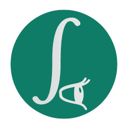

# Pulchritude

<p align="center">  </p>

### summary
Pulchritude is a game & rendering engine that ties together a lot of libraries
and exposes them to the user through a unified C ABI. The engine is written in
C++ with an exposing C ABI to allow as many libraries to be imported as
possible. The application software for the game can be written in any desired
language; the bulk of an application exists as a collection of dynamic
libraries that can each expose more functions and rely on each other, allowing
for multiple languages to be used in a simple and sane manner. The engine can
be extended easily by adding new dynamic libraries that expose a C ABI.

What this might end up looking like is:

```txt
                       ┌────────────┐
               ┌───────│Engine (C++)│◄────────────────────┐
               │       │Application │                     │
               │       └────────────┘                     │
               │         │                                │
               │         │                                │
               │         │     ┌───────────────────────┐  │
               │         │     │Libraries (C, C++, etc)│  │
               │         ▼     └─────────────┬─────────┘  │
               │   ┌──────────┐              ▼            │
               │   │Core Game │        ┌──────────────┐   │
               │   │Foundation│◄───────│Pulchritude's │───┘
               │   │(Zig, C)  │◄┐      │Exposing C ABI│
               │   └──────────┘ │      └──────────────┘
               │         │   └──┘            │
               │         ▼                   │
               │  ┌────────────────┐         │
               │  │Gameplay Logic  │◄────────┘
               └► │  (lua, D, Haxe)│◄┐
                  └────────────────┘ │
                                  └──┘
```

The engine would be the application entry point, and every other bit will exist
as either a static library, for math, networking, physics, gui, parsing,
logging, etc, or as a dynamic library, which would implement the application.
For clarity on wording, the static libraries will be known as library, and the
dynamic libraries as components. To clarify, most static libraries will be
called indirectly through dynamic libraries that expose a C ABI.

Every plugin should be replaceable with others that expose the same C ABI, it's
even a simple manner to replace the engine plugins; each plugin will have
corresponding CMake variable that will disable the build+install of that
plugin. This allows for even the most central part of the engine, such as the
logger or default memory allocator, to be replaced. In other words, the only
irreplacable part of Pulchritude is the cohesive interfaces between plugins.

Some plugins in some cases are harder to replace than others and might require
  changing underlying assets, but the idea will be to minimalize that when
  possible. For example, the engine uses SPIR-V rather than glsl/hlsl, uses
  PDS as a common data-asset interface, and so forth.

---

### requirements

  - works only on Linux currently
  - CMake
  - GCC or Clang
  - protobuf

### usage

linux
```sh
mkdir pulchritude ;
cd pulchritude ;
mkdir build install ;
git clone https://github.com/aodq/pulchritude-engine src ;
pushd src/ ;
git submodule update --init --recursive ;
pushd third-party/SPIRV-Tools/external ;
git clone https://github.com/khronosgroup/spirv-headers spirv-headers ;
popd ;
popd ;
cd build ;
cmake -G "ninja" -DCMAKE_INSTALL_PREFIX=../install ../src ;
ninja install ;
```

make sure to add `../install/bin/` to your PATH

### layout

The directory layout for the engine is:

  - application ; main entry point for user projects
  - puledit/ ; application that edits & builds user projects
  - library/ ; static libraries to provide minimal engine support
    - include/pulchritude ; auto-generated public includes for the entire engine
    - allocator/ | array/ | ... ; each plugin
      - include/ ; private includes
      - CMakeLists.txt
      - src/
  - third-party/ ; external libraries
  - skeleton ; these are the ABI defs to parse and export C headers & bindings
  - utils/ ; any utility programs that help facilitate engine building
    - binding-generator/ ; generates headers & bindings from skeleton PEL files
  - scripts/ ; legacy scripts that will be ported to utils/ later
  - documentation/ ; auto-generated documentation of the headers

When compiled, the application will install to bin/, and each each plugin will
install to bin/plugins

#### hello world example

with `puledit` installed, run
`puledit init-project --name "helloworld" --support-gpu false`.

this will generate `project.pds` as well as a base src under `src/main.cpp`
You can run this with `puledit run`, which will generate the project files
under `build-husk` (be sure to add this directory to your .gitignore), compile
your project, then runs your project.

other examples are at repo https://github.com/aodq/pulchritude-examples .
a full application is at https://github.com/aodq/pulde

For the most part, the best way to learn is to look through the example
tutorials.

---

### error handling

Error handling from C-ABIs is a bit of a mess. Preferrably we'd want to have
the error returned along with the value, and some sort of pattern matching to
address the error. Given the C-ABI, instead the error will be apart of the
parameters. The idea is that the bindings to your language will help here as
well.

```c
typedef enum {
  PulcInitializeError_noPlayers = 1,
} PulcInitializeError;
PulcGameState pulcInitialize(PuleError * err) {
  // silly example
  state->players = pulcAcquirePlayers();
  if (state->players == 0) {
    puleErrorPropagate(
      err,
      PuleError {
        .description = puleStringFormatDefault("failed to acquire players"),
        .id = PulcInitializeError_noPlayers,
        .sourceLocationNullable = __FILE__,
        .lineNumber = __LINE__,
        .child = nullptr,
      }
    );
    return PulcGameState {};
  }
  return state;
}
```

if you're using C or C++, the `PULE_error` macro helps simplify this;
`PULE_error(PulcInitializerError_noPlayers, "failed to acquire players");`

to consume an error is simple
```c
PuleError error;
PulcGameState gameState = pulcInitialize(&error);
switch (puleErrorConsume(&error)) { // checks & logs error
  default: break;
  case PulcInitializeError_noPlayers:
    exit(-1);
}
```

---

### API convention

Outside of the header/exported C-ABI symbols, style isn't relevant.

Firstly, functions are camelCased and must start with either 'puli' if they
are from a library, 'pule' if from the Engine, and 'pulc' if from a Component.

**No non-exported/local functions/variables should start with `pul` prefix**.
